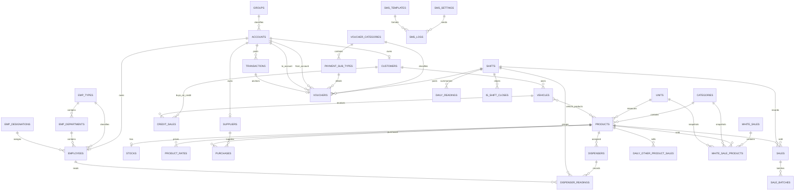

# Database Relationship and Page Usage Report

Audit date: Monday, July 27, 2026

Companion report: `PROJECT_CRUD_PAGE_REPORT.md`

## 1. Audit Scope

এই report-এর জন্য cross-check করা হয়েছে:

- সব migration এবং current MySQL schema
- `app/Models/*` Eloquent relationships
- সব controller-এর model usage, raw table query এবং join
- sidebar এবং non-sidebar React/Inertia pages
- create/update/delete-এর cross-table side effect
- report/PDF query dependencies

Current database snapshot:

- Connection: MySQL 8.0.46
- Database: `dispenser_management`
- Current table count: **51**
- Project migration: **45**
- Migration status: **সব migration Ran**
- Business/domain table: **37**
- Auth, permission, queue, cache এবং framework table: **14**

## 2. High-level Domain Relationship Map



## 3. Table Relationship and Page Usage

## 3.1 Company and Identity

### `company_settings`

- Model: `CompanySetting`
- Key: `id`
- Foreign key: নেই।
- Important fields: company identity, contact, tax/VAT, currency, logo, `is_registration`, status.
- Direct pages:
  - `/company-settings`
  - `/company-settings/create`
  - `/company-settings/{companySetting}`
  - `/company-settings/{companySetting}/edit`
- Global use:
  - `HandleInertiaRequests` থেকে company name, logo এবং registration flag সব Inertia page-এ share হয়।
  - Fortify registration enable/disable এই table-এর `is_registration` ব্যবহার করে।
  - প্রায় সব PDF controller company header/footer-এর জন্য first row ব্যবহার করে।
- Write behavior: direct CRUD; অন্য business table পরিবর্তন করে না।

### `users`

- Model: `User`
- Key: `id`
- Package relationships:
  - `User <-> roles` through `model_has_roles`
  - `User <-> permissions` through `model_has_permissions`
- Other relationship:
  - `daily_readings.employee_id -> users.id`
- Direct pages:
  - `/users`
  - `/settings/profile`
  - `/settings/password`
  - `/settings/two-factor`
  - authentication pages
- Indirect pages:
  - `/product/dispensers-reading`: authenticated user shift closing record-এর owner.
  - Dashboard/sidebar permissions.
- Write behavior: user CRUD, profile/avatar, password, email verification, ban state, 2FA.

### `permissions`

- Model: Spatie `Permission`
- Key: `id`
- Relationships:
  - many-to-many with roles through `role_has_permissions`
  - polymorphic many-to-many with users/models through `model_has_permissions`
- Direct page: `/permissions`
- Indirect use: route/controller middleware এবং sidebar visibility.

### `roles`

- Model: Spatie `Role`
- Key: `id`
- Relationships:
  - many-to-many with permissions through `role_has_permissions`
  - polymorphic many-to-many with users through `model_has_roles`
- Direct page: `/roles`
- Indirect use: `/users`, permission middleware, sidebar.

### Permission pivot tables

#### `role_has_permissions`

- Composite primary key: `permission_id + role_id`
- Cascades when role/permission is deleted.
- Used by `/roles`, `/permissions`, `/users` authorization.

#### `model_has_roles`

- Composite key includes model type/id and role.
- User-role assignment storage.
- Used by `/users`, authentication share data এবং sidebar permission checks.

#### `model_has_permissions`

- Direct user/model permission assignment storage.
- Current UI mainly role-based হলেও package এই table support করে।

## 3.2 Employee Organization

### `emp_types`

- Model: `EmpType`
- Relationships:
  - `hasMany(EmpDepartment)`
  - `hasMany(Employee)`
- Direct page: `/emp-types`
- Used by:
  - `/emp-departments` form/filter
  - `/employees`, create/edit/show
- Delete behavior: deleting an employee type cascades its departments; employee `emp_type_id` becomes null.

### `emp_departments`

- Model: `EmpDepartment`
- Foreign key: `emp_type_id -> emp_types.id`, cascade delete.
- Relationships:
  - belongs to employee type
  - has many employees
- Direct page: `/emp-departments`
- Used by: employee list/create/edit/show.
- Delete behavior: deleting department sets employee `department_id` to null.

### `emp_designations`

- Model: `EmpDesignation`
- Relationship: has many employees.
- Direct page: `/emp-designations`
- Used by: employee list/create/edit/show.
- Delete behavior: employee `designation_id` becomes null.

### `employees`

- Model: `Employee`
- Foreign keys:
  - `account_id -> accounts.id`, nullable, cascade when account is deleted
  - `emp_type_id -> emp_types.id`, set null
  - `department_id -> emp_departments.id`, set null
  - `designation_id -> emp_designations.id`, set null
- Relationships:
  - belongs to account, type, department, designation
  - has many daily other-product sales
- Direct pages:
  - `/employees`
  - `/employees/create`
  - `/employees/{employee}`
  - `/employees/{employee}/edit`
  - `/employees/{employee}/statement`
- Used by:
  - `/product/dispensers-reading`
  - `/shift-closed-list/{id}`
  - employee salary, advance, receipt/payment reports
- Write behavior:
  - employee create first creates an `accounts` row.
  - employee update also updates account name/status.
  - employee delete currently deletes only employee row; account row remains.

## 3.3 Product, Rate and Inventory

### `categories`

- Model: `Category`
- Relationships:
  - has many products
  - has many white-sale product rows
- Direct page: `/categories`
- Used by:
  - `/products`
  - `/stocks`, `/stock-report`
  - `/white-sales`
  - Sales/Credit Sales category snapshot through `category_code`
- Delete behavior:
  - category deletion attempts to cascade products.
  - white-sale product FK has no explicit cascade.
  - transactional product references may prevent the cascade.

### `units`

- Model: `Unit`
- Relationships:
  - has many products
  - has many daily other-product sales
  - has many white-sale product rows
- Direct page: `/units`
- Used by:
  - products, stock, customer bills, daily statement
  - purchase report
  - dispenser other-product table
  - white sales
- Delete behavior: cascades products and daily other-product sales; white-sale product FK has no explicit cascade.

### `products`

- Model: `Product`
- Foreign keys:
  - `category_id -> categories.id`, cascade
  - `unit_id -> units.id`, cascade
- Correct relationships:
  - belongs to category/unit
  - has one stock
  - has many rates, sales, daily other-product sales and white-sale product rows
- Other database children:
  - purchases
  - credit sales
  - dispensers and dispenser readings
  - vehicle-products pivot
  - other-product sales
- Direct page: `/products`
- Used by:
  - `/product-rates`
  - `/stocks`, `/stock-report`
  - `/purchases`
  - `/sales`
  - `/credit-sales`
  - `/dispensers`
  - `/product/dispensers-reading`
  - `/white-sales`
  - all product/sales/stock/balance reports
- Write side effects:
  - purchase increases stock.
  - regular sale, credit sale এবং dispenser other-product sale decrease stock.
  - white sale currently does not update stock.

### `product_rates`

- Model: `ProductRate`
- Foreign key: `product_id -> products.id`, cascade.
- Relationship: belongs to product.
- Direct page: `/product-rates`
- Used by:
  - Product list current purchase/sales price
  - Sales/Credit Sales/White Sales price lookup
  - Dispenser rate
  - Customer bill, Daily Statement, Balance Sheet
- `Product.activeRate()` uses latest active rate by `effective_date`.

### `stocks`

- Model: `Stock`
- Foreign key: `product_id -> products.id`, cascade.
- Unique constraint: one stock row per product.
- Relationship: belongs to product.
- Direct pages:
  - `/stocks`
  - `/stock-report`
- Mutated by:
  - Purchase: increment quantity
  - Sale: decrement quantity
  - Credit Sale: decrement quantity
  - Dispenser closing other-product sale: decrement quantity
  - Related update/delete methods reverse old stock then apply new stock
- Used by:
  - dashboard
  - balance sheet
  - liability/assets
  - dispenser calculation
- Database constraint preventing negative stock: নেই।

## 3.4 Account and Ledger Core

### `groups`

- Model: `Group`
- Relationship:
  - has many accounts by `groups.code -> accounts.group_code`
  - `parents` stores parent group code as a string.
- Direct page: `/groups`
- Used by:
  - Accounts filter/form
  - Customer, Supplier, Employee account creation
  - Office Payment payment-type selection
  - Cash/Bank/Loan/Liability report account classification
- Parent-child hierarchy is application-level; `parents` has no foreign-key constraint.

### `accounts`

- Model: `Account`
- Keys:
  - primary `id`
  - unique business key `ac_number`
- Foreign relationships:
  - `group_id -> groups.id`, set null
  - `group_code -> groups.code`, set null
- Eloquent relationships:
  - belongs to group through `group_code`
  - has one employee, supplier, customer
- Other database children:
  - `transactions.ac_number`
  - purchase `from_account_id`
  - office payment `to_account_id`
  - voucher `from_account_id` and `to_account_id`
- Direct page: `/accounts`
- Used by:
  - Customer/Supplier/Employee master creation
  - Purchases, Sales payment target, Vouchers, Office Payment
  - General Ledger, Cash Book, Bank Book
  - Loan, Liability/Assets, Balance Sheet
  - Customer/Supplier/Employee statements
- Balance fields:
  - `due_amount`
  - `paid_amount`
  - `total_amount`
- Most transaction workflows mutate `total_amount`; reports also calculate from `transactions`/`vouchers`, so this is a cached balance as well as a displayed value.

### `transactions`

- Model: `Transaction`
- Foreign key: `ac_number -> accounts.ac_number`, cascade delete.
- Key pattern:
  - `id` is a physical ledger-row key.
  - `transaction_id` is an application-generated business group ID shared by debit/credit rows.
- Created by:
  - Purchases
  - non-cash Sales
  - Payment Vouchers
  - Received Vouchers
  - Office Payments
- Referenced by:
  - purchases, sales, credit_sales, office_payments and vouchers using `transactions.id`
- Main pages:
  - `/general-ledger`
  - `/cash-book-ledger`
  - `/bank-book-ledger`
- Heavily used in:
  - customer/supplier/employee statements
  - daily statement
  - loans
  - liability/assets and balance sheet
  - monthly dispenser report
- Delete behavior: deleting an account cascades all transaction rows for its account number.

## 3.5 Customer, Supplier and Vehicle

### `customers`

- Model: `Customer`
- Foreign key: unique `account_id -> accounts.id`, cascade when account deleted.
- Relationships:
  - belongs to account
  - has many vehicles
  - database-level has many credit sales
- Direct pages:
  - `/customers`
  - `/customers/{customer}`
  - `/customers/{customer}/statement`
- Report pages:
  - Customer Details Bill
  - Customer Summary Bill
  - Customer Ledger Summary/Details
  - Customer Sales Report
  - Daily Statement
- Create flow:
  - creates Account
  - creates Customer
  - optionally creates Vehicle and pivot rows
  - optionally creates `credit_sales` row of type `previous`
- Delete flow: customer row only; linked account is not removed.

### `vehicles`

- Model: `Vehicle`
- Foreign key: `customer_id -> customers.id`, set null.
- Relationships:
  - belongs to customer
  - belongs to many products through `vehicle_products`
  - has many credit sales at database level
- Direct page: `/vehicles`
- Used by:
  - Customer detail
  - Credit Sales
  - Customer bills and Daily Statement
- Delete behavior: pivot rows cascade; credit-sale references have no explicit delete action and may restrict deletion.

### `vehicle_products`

- Model: `VehicleProduct`
- Foreign keys:
  - `vehicle_id -> vehicles.id`, cascade
  - `product_id -> products.id`, cascade
- Unique pair: `vehicle_id + product_id`
- Relationship purpose: which products a customer vehicle is allowed/associated with.
- Pages:
  - `/vehicles`
  - Customer create/edit vehicle section
  - Customer detail
  - Credit Sale vehicle/product selection

### `suppliers`

- Model: `Supplier`
- Foreign key: unique `account_id -> accounts.id`, cascade when account deleted.
- Relationships:
  - belongs to account
  - has many purchases
- Direct pages:
  - `/suppliers`
  - `/suppliers/{supplier}`
  - `/suppliers/{supplier}/statement`
- Used by:
  - Purchase entry/report
  - Payment Voucher
  - Liability/Assets and Balance Sheet
- Create flow: creates account then supplier.
- Delete flow: supplier row only; linked account remains.

## 3.6 Purchase and Sales

### `purchases`

- Model: `Purchase`
- Foreign keys:
  - supplier
  - product
  - transaction
  - from account
- Relationships: belongs to supplier, product, transaction, from account.
- Direct page: `/purchases`
- Report/detail pages:
  - Purchase Report Details
  - Supplier Detail/Statement
  - Dashboard
  - Daily/Balance/Liability reports
- Create transaction:
  - creates debit transaction for source account
  - may create credit transaction for supplier account
  - may create Accounts Payable credit transaction
  - updates account cached balances
  - creates purchase row
  - increments stock
- Update/delete reverse previous account, ledger and stock effects inside a database transaction.

### `sales`

- Model: `Sale`
- Foreign keys:
  - `shift_id`
  - nullable `transaction_id`
  - `product_id`
- Customer/vehicle are denormalized strings:
  - `customer`
  - `mobile_number`
  - `vehicle_no`
- Relationships: product, shift, transaction, batches; category through `category_code`.
- Direct page: `/sales`
- Used by:
  - Customer Sales Report
  - Daily Statement
  - Dashboard
  - Balance Sheet
  - Dispenser shift-closing calculation
- Create transaction:
  - creates ledger transaction only for non-cash payment
  - increments destination account cached balance
  - creates sale
  - decrements stock
  - creates sale batch link

### `sale_batches`

- Model: `SaleBatch`
- Foreign key: `sale_id -> sales.id`, cascade.
- Index: `batch_code`
- Relationship: many batch rows can point to sales; each row belongs to one sale.
- Used by:
  - `/sales`
  - batch invoice PDF route
- Batch code groups multiple product sale rows created in one submit.

### `credit_sales`

- Model: `CreditSale`
- Foreign keys:
  - nullable shift
  - nullable transaction
  - customer
  - nullable vehicle
  - nullable product
- Relationships: customer, vehicle, product, shift, transaction; category through `category_code`.
- Direct page: `/credit-sales`
- Used by:
  - Customer detail/statement
  - Customer bills and ledger reports
  - Daily Statement
  - Dashboard
  - Balance Sheet
  - Dispenser shift-close calculation
- `type`:
  - `regular`: normal product credit sale
  - `previous`: opening/previous customer due, often without product/vehicle/shift
- Create/update/delete adjusts stock for regular sales.

## 3.7 Voucher and Accounting Classification

### `voucher_categories`

- Model: `VoucherCategory`
- Relationships:
  - has many payment sub types
  - has many vouchers
- Direct CRUD page: নেই; seeded reference/master data.
- Used by:
  - `/payment-sub-types`
  - Payment Voucher
  - Received Voucher
  - Cash Book
  - Customer Ledger Summary
- Categories are employee, supplier, customer, office, general, liability, etc.

### `payment_sub_types`

- Model: `PaymentSubType`
- Foreign key: `voucher_category_id -> voucher_categories.id`.
- Relationships: belongs to category, has many vouchers.
- Direct page: `/payment-sub-types` (non-sidebar).
- Used by:
  - Payment/Received Voucher forms and lists
  - Employee salary/advance calculations
  - Loans
  - Dashboard
  - Balance Sheet
  - Cash Book
- Codes such as `1001`, `1002`, `1074`, `1076` are business-rule identifiers used directly in reports/controllers.

### `vouchers`

- Model: `Voucher`
- Foreign keys:
  - shift
  - voucher category
  - payment sub type
  - from account
  - to account
  - one physical transaction row
- Relationships: category, sub type, shift, from account, to account, transaction.
- Direct pages:
  - `/vouchers/payment`
  - `/vouchers/received`
- Used by:
  - Customer/Supplier/Employee details and statements
  - Daily Statement
  - Cash Book and Bank Book
  - General accounting reports
  - Loans
  - Monthly Dispenser Report
- Voucher amount and payment metadata live in linked `transactions`; voucher itself has no amount column.
- Payment Voucher creates paired debit/credit transaction rows and points to the debit row.
- Received Voucher creates paired credit/debit rows and points to the debit row.

## 3.8 Office Payment

### `office_payments`

- Model: `OfficePayment`
- Foreign keys:
  - shift
  - transaction
  - destination account
- Relationships: shift, transaction, to account.
- Direct page: `/office-payments`
- Used by:
  - Dispenser shift closing
  - Shift Closed List
  - Balance Sheet
  - Liability/Assets
- Amount is stored in linked `transactions`, not in `office_payments`.
- Create/update/delete also changes destination account `total_amount`.

## 3.9 Dispenser and Shift Closing

### `shifts`

- Model: `Shift`
- Direct page: `/shifts`
- Database children:
  - sales
  - credit sales
  - vouchers
  - office payments
  - dispenser readings
  - daily readings
  - shift closures
  - daily/legacy other-product sales
  - white sales
- Used by almost every operational entry and date/shift report.

### `dispensers`

- Model: `Dispenser`
- Foreign key: `product_id -> products.id`, cascade.
- Relationships: belongs to product; has many readings.
- Direct page: `/dispensers`
- Used by:
  - `/product/dispensers-reading`
  - `/shift-closed-list/{id}`
- A dispenser is assigned to one product.

### `dispenser_readings`

- Model: `DispenserReading`
- Foreign keys: shift, employee, dispenser, product; all nullable, cascade.
- Relationships: belongs to all four parent models.
- Written by: `/product/dispensers-reading`
- Read by:
  - Shift Closed List detail
  - Monthly Dispenser Report
- Stores meter start/end/test/net, rate and total sale snapshot.

### `daily_readings`

- Model: `DailyReading`
- Foreign keys:
  - shift
  - `employee_id -> users.id`
- Relationships: belongs to shift এবং authenticated user.
- Written by: shift-closing submit.
- Read by:
  - Shift Closed List
  - Monthly Dispenser Report
  - Cash Book summary context
- Stores shift totals: fuel/other sales, receipts, payments, office payment and final due.

### `is_shift_closes`

- Model: `IsShiftClose`
- Foreign key: shift, cascade.
- Unique constraint: `close_date + shift_id`
- Written by: dispenser shift-close submit.
- Direct page: `/shift-closed-list`
- Read by:
  - Shift Closed List
  - Cash Book
  - Monthly Dispenser Report
- This table is the authoritative marker preventing duplicate close for the same date and shift.

### `daily_other_product_sales`

- Model: `DailyOtherProductSale`
- Foreign keys: shift, product, unit, employee; all cascade.
- Written by: dispenser shift-closing page.
- Read by:
  - Shift Closed List detail
  - Monthly Dispenser Report
- Also decrements product stock during creation.

### `other_product_sales`

- Model: `OtherProductSale`
- Foreign keys: shift, employee, product.
- Current controller/page direct use: পাওয়া যায়নি।
- Likely legacy predecessor of `daily_other_product_sales`.
- No cascade action was specified for its three foreign keys.

## 3.10 SMS

### `sms_settings`

- Model: `SMSSetting`
- Relationship: has many SMS logs.
- Direct page: `/sms-configs`
- Used by customer SMS sending.
- Delete behavior: related log `sms_setting_id` becomes null.

### `sms_templates`

- Model: `SMSTemplate`
- Relationship: has many SMS logs.
- Direct page: `/sms-templates`
- Used by:
  - Customer detail SMS form
  - Customer SMS send action
- Delete behavior: related log `sms_template_id` becomes null.

### `sms_logs`

- Model: `SMSLog`
- Foreign keys:
  - nullable template, set null
  - nullable SMS setting, set null
- Direct page: `/sms-logs`
- Written by: customer SMS sending workflow.
- Preserves phone, final message, response, sent/failed state and error.

## 3.11 White Sales

### `white_sales`

- Model: `WhiteSale`
- Foreign key: shift.
- Relationship: belongs to shift; has many product rows.
- Direct page: `/white-sales`
- Stores denormalized walk-in/company customer identity and invoice total.
- Used by white-sale single invoice PDF.
- Current white-sale flow does not create ledger transactions or modify stock.

### `white_sale_products`

- Model: `WhiteSaleProduct`
- Foreign keys:
  - white sale
  - product
  - category
  - unit
- Relationships: belongs to all four.
- Direct page: line-item section of `/white-sales`.
- Category/unit are snapshots through IDs from the selected product.
- Foreign keys do not specify cascade; controller manually deletes line rows before parent deletion.

## 3.12 Framework Tables

### `sessions`

- Optional `user_id`; migration only indexes it and does not create a foreign-key constraint.
- Used by Laravel session authentication, not a business page.

### `password_reset_tokens`

- Password reset workflow.

### `cache`, `cache_locks`

- Laravel cache and atomic lock storage.

### `jobs`, `job_batches`, `failed_jobs`

- Queue infrastructure.
- Current project SMS flow appears synchronous; no direct business page writes these tables in inspected controllers.

### `migrations`

- Laravel migration history; all project migrations currently ran.

## 4. Page-to-table Usage Matrix

| Page/Module | Primary writes | Main joined/read tables |
|---|---|---|
| Company Setting | `company_settings` | Global page/PDF share |
| Shifts | `shifts` | Sales, vouchers, dispenser/closing tables |
| Employee Type | `emp_types` | Departments, employees |
| Department | `emp_departments` | Types, employees |
| Designation | `emp_designations` | Employees |
| Employees | `accounts`, `employees` | Types, departments, designations, vouchers, transactions, payment sub types |
| Categories | `categories` | Products |
| Units | `units` | Products |
| Products | `products` | Categories, units, rates |
| Product Rates | `product_rates` | Products |
| Stocks | `stocks` | Products, categories, units |
| Customers | `accounts`, `customers`, optional `vehicles`, `vehicle_products`, previous `credit_sales` | Vouchers, transactions, SMS tables |
| Vehicles | `vehicles`, `vehicle_products` | Customers, products |
| Suppliers | `accounts`, `suppliers` | Purchases, vouchers, transactions |
| Purchases | `purchases`, `transactions`, `stocks`, account balances | Suppliers, products, accounts |
| Sales | `sales`, optional `transactions`, `sale_batches`, `stocks`, account balances | Products, rates, shifts |
| Credit Sales | `credit_sales`, `stocks` | Customer, vehicle, product, shift |
| Dispenser Settings | `dispensers` | Products, rates, previous readings |
| Dispenser Calculation | `dispenser_readings`, `daily_other_product_sales`, `daily_readings`, `is_shift_closes`, `stocks` | Sales, credit sales, vouchers, transactions, office payments |
| Shift Closed List | delete/read closing tables | Shifts, dispensers, products, units, employees |
| Groups | `groups` | Self-parent lookup, accounts |
| Accounts | `accounts` | Groups |
| Payment Sub Types | `payment_sub_types` | Voucher categories |
| Payment Voucher | `vouchers`, paired `transactions`, account balances | Categories, sub types, shifts, accounts |
| Received Voucher | `vouchers`, paired `transactions`, account balances | Categories, sub types, shifts, accounts |
| Office Payment | `office_payments`, `transactions`, account balance | Shift, groups/accounts |
| White Sales | `white_sales`, `white_sale_products` | Shift, product, category, unit, rates |
| SMS Config | `sms_settings` | SMS logs |
| SMS Template | `sms_templates` | SMS logs |
| SMS Logs | delete/read `sms_logs` | Settings, templates |
| Users/Roles/Permissions | users and Spatie permission tables | Authentication/sidebar permissions |

## 5. Report Page Join Dependencies

### Dashboard

- `accounts`
- `sales`
- `credit_sales`
- `purchases`
- `products`
- `stocks`
- `vouchers`
- `payment_sub_types`

### Customer Details/Summary Bill

- `credit_sales`
- `customers`
- `vehicles`
- `products`
- `units`
- `product_rates`
- details bill additionally joins `transactions`

### Customer Ledger Summary/Details

- `customers`
- `accounts`
- `credit_sales`
- `vouchers`
- `transactions`
- `voucher_categories`
- details report additionally joins `shifts`

### Customer Sales Report

- Primarily `sales`, product and shift relations.
- Note: regular `sales` stores customer as a string, not `customer_id`.

### Daily Statement

- `sales`
- `credit_sales`
- `customers`
- `vehicles`
- `products`
- `units`
- `product_rates`
- `vouchers`
- `transactions`
- `accounts`
- `shifts`

### Purchase Report Details

- `purchases`
- suppliers, products and their unit relations.

### Stock Report

- `stocks`
- `products`
- `categories`
- `units`

### Shift Closed and Monthly Dispenser Reports

- `is_shift_closes`
- `shifts`
- `daily_readings`
- `dispenser_readings`
- `dispensers`
- `daily_other_product_sales`
- `products`
- `units`
- `employees`
- monthly report also uses `vouchers` and `transactions`

### General Ledger

- `accounts`
- `transactions`

### Cash Book Ledger

- `is_shift_closes`
- `shifts`
- `vouchers`
- `transactions`
- from/to `accounts`
- `payment_sub_types`
- `voucher_categories`

### Bank Book Ledger

- `accounts`
- `transactions`
- detail page additionally joins `vouchers` and `shifts`

### Liability and Assets

- `accounts`
- `vouchers`
- `transactions`
- `suppliers`
- `customers`
- `credit_sales`
- `purchases`
- `office_payments`
- `stocks`

### Balance Sheet

- `sales`
- `credit_sales`
- `products`
- `product_rates`
- `stocks`
- `purchases`
- `vouchers`
- `payment_sub_types`
- `transactions`
- `customers`
- `suppliers`
- `office_payments`

### Loan Pages

- Loan accounts are identified from `accounts/groups`.
- Loan received/payment/interest/settlement values come from:
  - `vouchers`
  - `transactions`
  - `payment_sub_types`

### Customer, Supplier and Employee Statements

- Customer: `credit_sales + vouchers + transactions + accounts`
- Supplier: `purchases + vouchers + transactions + accounts`
- Employee: `employees + accounts + vouchers + transactions + payment_sub_types`

## 6. Cross-table Write Flows

### Customer Creation

```text
accounts
  -> customers
       -> vehicles (optional)
            -> vehicle_products (optional)
       -> credit_sales(type=previous) (optional)
```

### Supplier Creation

```text
accounts -> suppliers
```

### Employee Creation

```text
accounts -> employees
              -> emp_types / emp_departments / emp_designations
```

### Purchase

```text
accounts(source/supplier/payable)
  <-> transactions (one business transaction ID, multiple ledger rows)
  -> purchases
  -> stocks increment
```

### Regular Sale

```text
accounts(destination, non-cash only)
  -> transactions (optional)
  -> sales
  -> sale_batches
  -> stocks decrement
```

### Credit Sale

```text
customers + vehicles + products + shifts
  -> credit_sales
  -> stocks decrement
```

### Payment Voucher

```text
from_account total decreases
to_account total increases
  -> paired transactions
  -> vouchers(voucher_type=Payment)
```

### Received Voucher

```text
from_account total increases
to_account total decreases
  -> paired transactions
  -> vouchers(voucher_type=Receipt)
```

### Office Payment

```text
to_account total increases
  -> transaction
  -> office_payments
```

### Shift Closing

```text
dispenser_readings
daily_other_product_sales -> stocks decrement
daily_readings
is_shift_closes
```

### White Sale

```text
white_sales -> white_sale_products
```

No current link to `stocks`, `transactions`, `accounts` or `sms_logs` was found in `WhiteSaleController`.

## 7. Relationship and Integrity Findings

### Critical

1. `PaymentSubType` model-এর `$fillable`-এ `code` নেই, কিন্তু `code` database-এ required/unique এবং create/update page এটি mass-assign করে। New Payment Sub Type create/update fail অথবা code silently discard হওয়ার সম্ভাবনা আছে।
2. `DispenserReadingController` fallback হিসেবে `Auth::id()` দিয়ে `dispenser_readings.employee_id` লেখে, কিন্তু FK `employees.id` reference করে। Auth user ID এবং employee ID একই না হলে foreign-key failure অথবা wrong employee link হবে।
3. Customer, Supplier এবং Employee create flow account + profile row create করে, কিন্তু `DB::transaction` ব্যবহার করে না। দ্বিতীয় insert fail হলে orphan account তৈরি হবে।
4. Customer, Supplier এবং Employee delete শুধু profile row delete করে; associated account delete করে না। এতে orphan account এবং financial selection pollution হতে পারে।
5. White Sale create/update parent এবং multiple child row লিখে, কিন্তু database transaction নেই। Child insert fail হলে partial invoice persist হতে পারে।

### Incorrect Eloquent Relationships

1. `Customer::sales()` default `customer_id` আশা করে, কিন্তু `sales` table-এ `customer_id` নেই; customer string field আছে। Customer-এর valid normalized relation হলো `credit_sales`.
2. `Vehicle::sales()` default `vehicle_id` আশা করে, কিন্তু `sales` table-এ `vehicle_id` নেই; `vehicle_no` string আছে। Vehicle-এর valid relation হলো `credit_sales`.
3. `Product::vehicles()` `hasMany(Vehicle)` ব্যবহার করে, কিন্তু `vehicles.product_id` নেই। এটি `belongsToMany(Product/Vehicle, vehicle_products)` reciprocal relation হওয়া উচিত।
4. `Transaction::sales()` local `transaction_id` string-এর সঙ্গে `sales.transaction_id` integer FK compare করে। Correct physical relation `transactions.id -> sales.transaction_id`.
5. `Voucher::transactions()` `transactions.transaction_id`-কে voucher-এর physical `transaction_id` integer-এর সঙ্গে compare করে। Paired rows পেতে আগে linked transaction-এর business `transaction_id` নিতে হবে।

### Schema and Naming Risks

1. `accounts` একই group relationship দুইভাবে রাখে: `group_id` এবং `group_code`; disagreement সম্ভব।
2. `groups.parents` self-reference code হলেও foreign key নেই।
3. `sales.category_code` এবং `credit_sales.category_code` category relation হিসেবে ব্যবহৃত হলেও foreign key নেই; category code update হলে stale relation হবে।
4. `daily_readings.employee_id` আসলে `users.id`; column name operator/user identity বোঝায় না।
5. `dispenser_readings.shift_id` nullable কিন্তু default `0`, একই সঙ্গে valid shift FK; `0` valid shift না হলে default ব্যবহার unsafe.
6. `OfficePayment` model-এ একই FK-এর জন্য `toAccount()` এবং `to_account()` duplicate relation আছে।
7. `VoucherType` model আছে, কিন্তু current schema-তে `voucher_types` table নেই; vouchers enum ব্যবহার করে।
8. `other_product_sales` table/model আছে, কিন্তু current inspected controller/page-এ direct use পাওয়া যায়নি।

### Business-rule Coupling

1. Customer, Supplier এবং Employee account group IDs/codes controller-এ hardcoded:
   - Customer: ID `7`, code `100020001`
   - Supplier: ID `11`, code `400010001`
   - Employee: ID `16`, code `40002`
2. Purchase Accounts Payable account name string দিয়ে খোঁজে: `Accounts Payable`.
3. Employee salary/advance/loan reports specific payment subtype codes hardcode করে।
4. Office payment methods specific group codes `100020002`, `100020003`, `100020004` থেকে তৈরি হয়।
5. Seeder order বা production master-data code বদলালে multiple pages/report silently wrong classification দিতে পারে।

### Delete and Cascade Risks

1. Category/unit deletion product cascade করতে পারে, কিন্তু purchase/sale references restrict করায় operation fail হতে পারে।
2. Account deletion transactions এবং employee/customer/supplier cascade করতে পারে, কিন্তু vouchers/purchases/office payments restrict করতে পারে।
3. White-sale line FKs cascade নয়; controller-level manual deletion-এর ওপর নির্ভরশীল।
4. `sms_logs` uses set-null correctly, preserving audit logs after config/template deletion.
5. Stock quantity-এর জন্য non-negative database check নেই।

## 8. Recommended Database Improvements

1. `PaymentSubType::$fillable`-এ `code` যোগ করা এবং create/update test করা।
2. Dispenser reading-এর `reading_by` strictly `employees.id` validate করা; fallback user-to-employee mapping ছাড়া `Auth::id()` ব্যবহার না করা।
3. Customer/Supplier/Employee/White Sale multi-table writes `DB::transaction`-এ নেওয়া।
4. Profile delete policy ঠিক করা:
   - account-সহ hard delete,
   - soft delete,
   - অথবা account deactivate.
5. Incorrect Eloquent relationships fix এবং missing reciprocal relationships যোগ করা।
6. `accounts.group_id/group_code` থেকে একটি canonical FK নির্ধারণ করা।
7. `groups.parents`-কে nullable `parent_id` FK-তে normalize করা।
8. Sale customer/vehicle strings intentional snapshot হলে misleading Eloquent relations remove করা; normalized reporting দরকার হলে nullable `customer_id/vehicle_id` যোগ করা।
9. Category snapshot code intentional হলে FK relationship method remove/rename করা; otherwise `category_id` ব্যবহার করা।
10. `Voucher::transactions()`-কে proper relation/query scope-এ পরিবর্তন করা।
11. Legacy `other_product_sales` এবং orphan `VoucherType` model remove/migrate করার আগে usage audit করা।
12. Hardcoded group/payment subtype identifiers config বা database semantic key service-এ centralize করা।
13. White Sales stock/ledger/SMS integration business requirement অনুযায়ী implement অথবা explicitly mark non-stock/non-ledger sale.
14. Stock mutation-এর আগে availability validation এবং database/application guard যোগ করা।
15. Key workflows-এর integration tests যোগ করা:
   - purchase -> ledger + stock
   - sale -> ledger + stock + batch
   - voucher -> paired transactions + account balance
   - shift close -> all four closing tables
   - customer/supplier/employee -> account lifecycle

